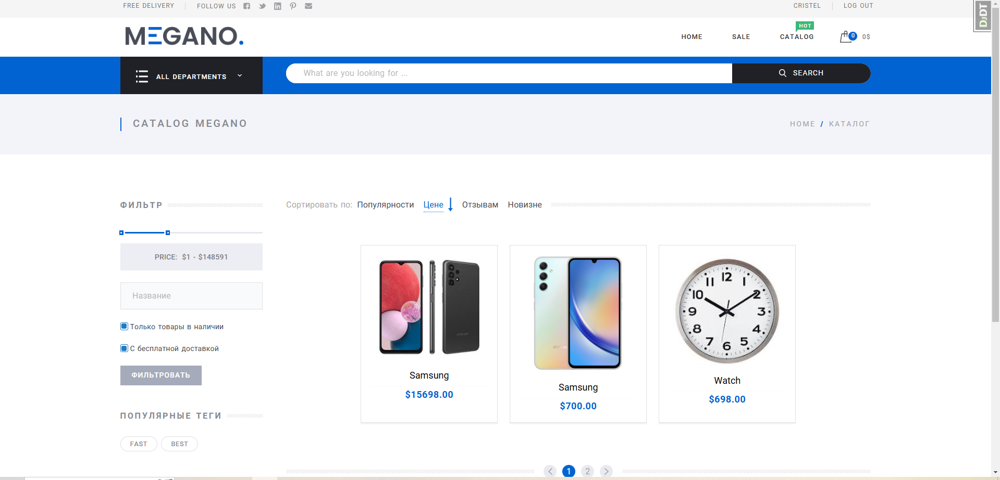
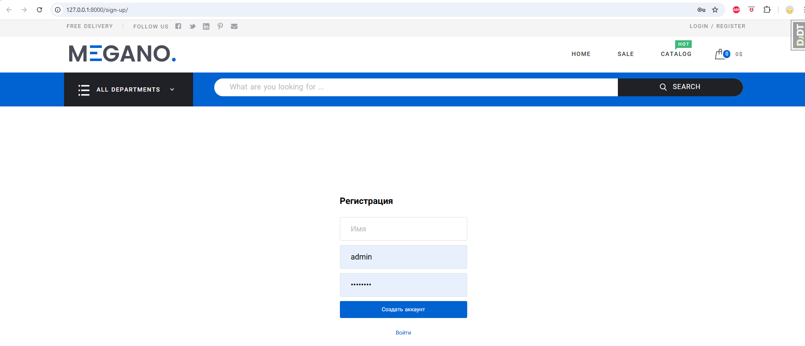
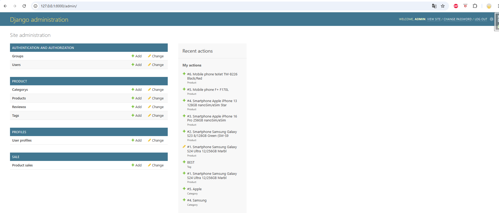
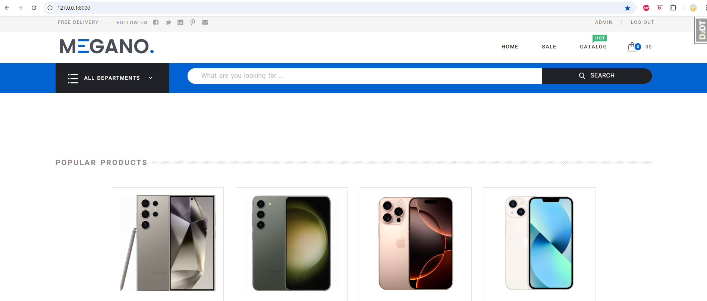
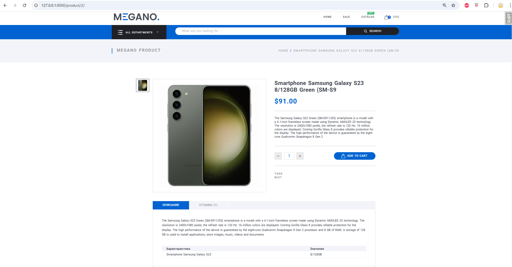
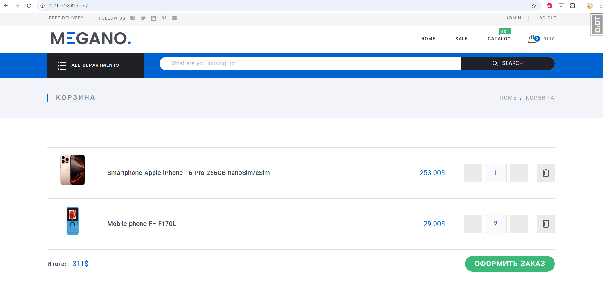
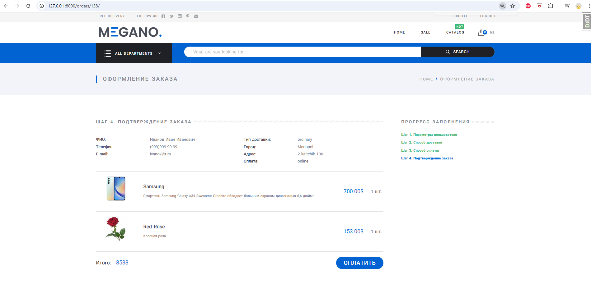
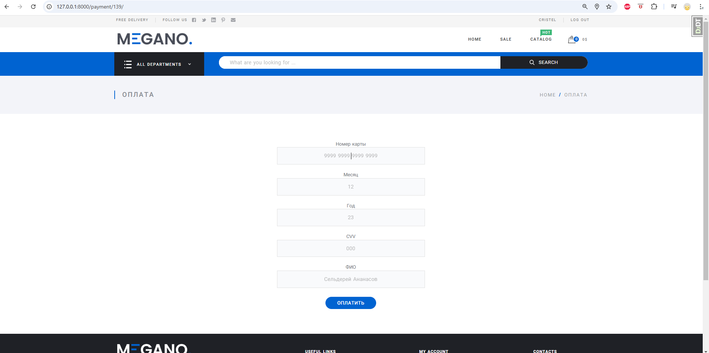

<h1 style="display: flex; align-items: center; justify-content: center">Интернет-магазин MEGANO</h1>

<nav>
  <h2>Оглавление</h2>
  <ul>
    <li><a href="#Описание">Описание проекта</a></li>
    <li><a href="#Функциональность">Функциональность</a></li>
    <li><a href="#Технологии">Технологии</a></li>
    <li><a href="#Установка и запуск">Установка и запуск</a></li>
    <li><a href="#Использование">Использование</a></li>
  </ul>
</nav>

<h2 id="Описание" style="display: flex; align-items: center; justify-content: center">
Описание проекта
</h2>

    

        Megano — это веб-приложение на Django, которое позволяет пользователям создавать и управлять своими списками покупок. Пользователи могут добавлять продукты, маркировать их как купленные и удалять их из списка.
        Фронтенд и Бэкенд в данном проекте являются отдельными приложениями и взаимодействуют между собой 
        через API используя Django Rest Framework.
    

<h2 id="Функциональность">
Функциональность
</h2>

На данный момент Megano предоставляет следующие возможности:

<ul>
    <li>Регистрация и аутентификация пользователей</li>
    <li>Просмотр каталога товаров</li>
    <li>Фильтрация, сортировка товаров</li>
    <li>Просмотр карточки товара</li>
    <li>Добавление товара в корзину</li>
    <li>Покупка товара</li>
    <li>Добавление комментариев к товару</li>
    <li>Административная панель для управления пользователями, товарами и заказами.</li>

</ul>

<h2 id="Технологии">
    Технологии
</h2>

<ul>
    <li>Python — язык программирования, на котором написан проект</li>
    <li>Django — фреймворк для веб-разработки на Python</li>
    <li>Django REST framework (DRF) — набор инструментов для создания веб-сервисов и API на основе фреймворка Django</li>
    <li>Poetry — инструмент для управления зависимостями и сборкой пакетов в Python</li>
    <li>Django Debug Toolbar — инструмент для отладки Django-кода</li>
    <li>Django Filter — сторонняя библиотека, которая упрощает создание фильтров для Django моделей.</li>
</ul>

<h2 id="Установка и запуск">
    Установка и запуск
</h2>

<h3>
    Предварительные требования
</h3>
<ul>
    <li>Python (3.8 или выше)</li>
    <li>Django (3.2.7 или выше)</li>
    <li>pip</li>
</ul>

Для установки и запуска Megano следуйте приведенным ниже инструкциям:

<ol>
<li>
    Клонируйте репозиторий с проектом:
    
git clone https://github.com/VitaliyVZH/Megano.git

</li>

<li>Перейдите в каталог проекта:

cd Megano

</li>

<li>Создайте и активируйте виртуальное окружение:
  
python -m venv venv

  
source venv/bin/activate  # на Windows: venv\Scripts\activate

</li>

<li>
    Установите приложение "frontend":
    
pip install Megano/diploma-frontend/dist/diploma-frontend-0.6.tar.gz

</li>
    
<li>Установите poetry (контроль зависимостей)

pip install poetry

</li>
<li>Установите зависимости проекта:

poetry install

</li>
<li>Перейдите в подкаталог megano:

cd megano

</li>
<li>Примените миграции базы данных:

python manage.py migrate

</li>
<li>Загрузите фикстуры для тестового просмотра сайта:

python manage.py loaddata all_data.json

В результате, БД наполнится ограниченным колличеством данных, включая профиль администратора.
</li>
<li>Запустите проект:

python manage.py runserver

</li>
</ol>

<h2 id="Использование">Использование</h2>

<h3>Регистрация и аутентификация пользователей</h3>

Для регистрации перейдите на страницу http://127.0.0.1:8000/sign-up/ и заполните форму. После регистрации вы можете войти в систему, перейдя на страницу http://127.0.0.1:8000/login/.

Для входа от лица администратора сайта используйте логин: admin, пароль: Lol2023!

<h3>Управление товарами</h3>

Для управления товарами перейдите в административную панель по адресу http://127.0.0.1:8000/admin/ и войдите, используя учетные данные суперпользователя. В разделе "Товары" вы можете добавлять, редактировать и удалять товары.

<h3>Просмотр списка товаров</h3>

Для просмотра списка товаров перейдите на главную страницу проекта по адресу http://127.0.0.1:8000/. Здесь вы увидите список всех доступных товаров. Для просмотра подробной информации о товаре щелкните на его название.

<h3>Просмотр карточки товара</h3>

Для просмотра карточки товара перейдите на главную страницу проекта по адресу http://127.0.0.1:8000/product/2/.

<h3>Добавление товаров в корзину и просмотр содержимого корзины</h3>

Для добавления товара в корзину щелкните кнопку "Добавить в корзину" на странице товара. Для просмотра содержимого корзины перейдите на страницу http://127.0.0.1:8000/cart/.

<h3>Оформление заказа</h3>

Для оформления заказа перейдите на страницу корзины (http://127.0.0.1:8000/orders/num_order) и нажмите кнопку "Оформить заказ". После оформления заказа вы увидите страницу с информацией о заказе и его статусе.
                     

<h3>Оплата заказа</h3>

Ввод реквизитов карты http://127.0.0.1:8000/payment/num_orders 
                     
